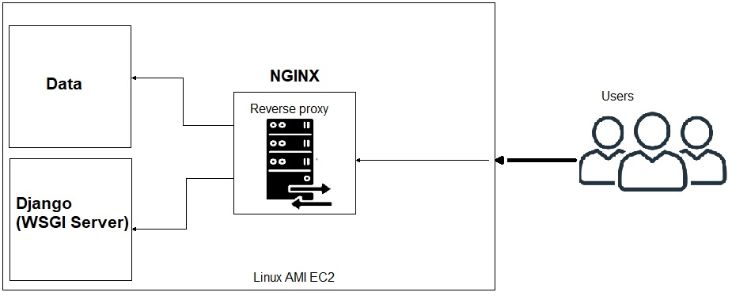

# manager boilerplate

## Overview

The goal of this project is to create an independent web app with a dashboard to create, update and delete instances. As a instance, it means the following:

- Users (clients and staff, create staff users and check clients).
- Roles (for users, create roles).
- Permissions (for roles).
- Products (create, see, update and delete).
- Orders (just see them).
- Sales reports and orders reports.

The second purpose, and the most important, is to mixed the Manager App with the Ecommerce App, hence both projects work together but in separate boxes. It'll be discuss later. However, to clarify the idea, there is an API that contains several resources (endpoints), and through those resources actions such as create, list, update all instances (Users, Roles, etc) are executed.
The Manager API is consumed by a website described below (Manager Dashboard). The Ecommerce website (separate project) consume also another API (Ecommerce API). Hence, both projects, the Manager and Ecommerce projects are APIs working separately with the intention to mixed them in a single box but remaining separate APIs still. The website also will remain separate.

## Project links

- Manager Dashboard website: click [here](http://man-static.s3-website.us-east-2.amazonaws.com/login)
- Manager API documentation endpoints: [here](http://ec2-18-191-207-76.us-east-2.compute.amazonaws.com/api/docs/)
- Ecommerce: [here](http://ec4-statics.s3-website.us-east-2.amazonaws.com/)

## Architecture

How the project is structure as a single entity is not being discuss here. A similar aproach was taken in the Ecommerce project. The link is here: [Ecommerce](http://ec4-statics.s3-website.us-east-2.amazonaws.com/).

However, here is a simple diagram that sums up the project:

The picture above represents just a single entity that contains the Dashboard Manager API. Since the goal is to have both, the Ecommerce API and the Manager API in separate processes but working together, the following image represents the idea:

As can be seen, there is an extra box (container). Then, four containers are deployed:

- Database (Postgresql).
- NGINX (Reverse proxy).
- Ecommerce (Django framework, uwsgi server, django-rest-framework).
- Manager (Django framework, uwsgi server, django-rest-framework).

Both, the Manager and the Ecommerce, by using Django and Python, create and handle the database in a way that tables are created using models (ORM). The challenge is to synchonize both containers (Manager and Ecommerce), making sure in the Manager API products are provisioned and then those products can be seen in the Ecommerce web site. The list of requirements are:

- Products are managed in the Manager dashboard (website that consume the Manager API) and seen in the Ecommerce.
- Clients can be seen in the dashboard and register inside the Ecommerce.
- Staff users are created.
- Orders are created in the ecommerce and stats about them seen in the manager.
- Roles and permissions are created in the Manager for staff.
- Clients are unable to access the Manager and staff can not access the Ecommerce.
- Etc.

## Future improvements:

As any other project under construction, future improvements are:

1. Make it real time, so when a change is made in the Manager, it is reflected in the Ecommerce.
2. Move the website to CloudFormation and use a custom domain like www.ecommerce.com.
3. Update the website to latest versions of React.
4. Create a devops pipeline and use Test for the code (although some parts are being tested).
5. Prepopulate the database in some cases. For instance roles and permissions.
6. Etc.
