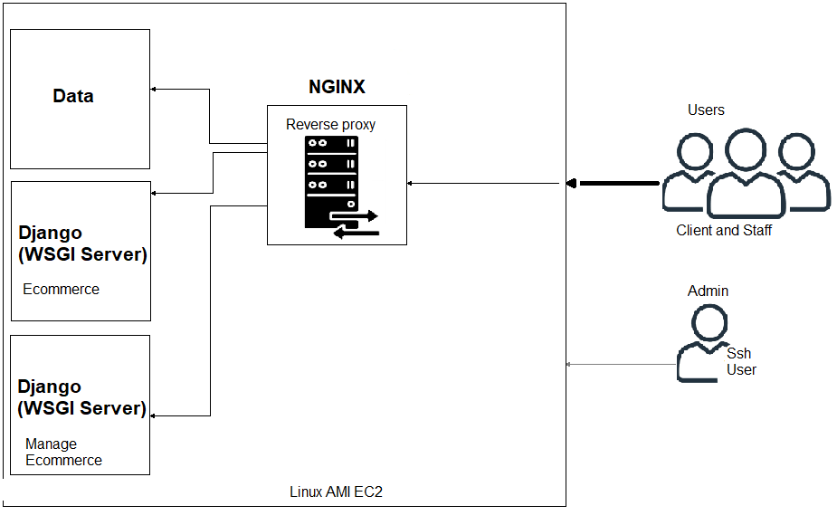

# ecommerce-manager


## Overview

The project consists in an Ecommerce web API and an Ecommerce Manager API. Both are working separatetly now on linux machines (Amazon AMI) but the main goal is to put them in a single box (linux AWS EC2 instance) in order for both to work together as instances with clear limit goals:

- Ecommerce: Present products and behave as a ecommerce.
- Manager: Manage products, orders, users and see stats in regards to orders and sells.

The image below pictures a representation on how both projects are deployed separatly right now:


As stated previously, the idea is to deploy both like this:




## Bussiness requirements

1. Ecommerce Manager API.

* Main purpuse: Give access to staff user to bring administration of the system.

- Users (clients and staff, create staff users and check clients)
- Orders (see orders from ecommerce)
- Products (create, delete and change products)
- Roles (for users, create roles)
- Permissions (for roles)

2. Ecommerce API.

* Bring access to client for registering and buying products.

- Users (clients)
- Orders (open orders for products)
- Products (buying products)

## Technical requirements

1. Django restframework as a backend for the API.
2. Posgresql as a relational database.
3. React Framework for the frontend.
3. Docker and Docker compose.
4. AWS Linux EC2 instances, VPC's etc., for the server.
5. AWS S3 buckets to store media/static files.
6. AWS S3 buckets to store a static web site in React Framework.
7. NGINX server as reverse proxy to access resources when users or clients need to.
8. uWSGI as a web server.


1. ### Django

Everyting is a container here, which in simple terms allows us to have a separate instance (like a Virtual Machine).
For building the Ecommerce Manager API container, the following snippet describes it:

```yaml
FROM python:3.9-alpine
LABEL maintainer="Cesar O."

ENV PYTHONUNBUFFERED 1

COPY ./manager/requirements.txt /tmp/requirements.txt
COPY ./manager/requirements.dev.txt /tmp/requirements.dev.txt
COPY ./manager/scripts /scripts

COPY ./manager /app
WORKDIR /app
EXPOSE 8000

ARG DEV=false
RUN python -m venv /py && \
    /py/bin/pip install --upgrade pip && \
    apk add --update --no-cache postgresql-client jpeg-dev && \
    apk add --update --no-cache --virtual .tmp-build-deps \
        build-base postgresql-dev musl-dev zlib zlib-dev linux-headers && \
    /py/bin/pip install -r /tmp/requirements.txt && \
    if [ $DEV = "true" ]; \
        then /py/bin/pip install -r /tmp/requirements.dev.txt ; \
    fi && \
    rm -rf /tmp && \
    apk del .tmp-build-deps && \
    adduser \
        --disabled-password \
        --no-create-home \
        django-user && \
    mkdir -p /vol/web/media && \
    mkdir -p /vol/web/static && \
    chown -R django-user:django-user /vol && \
    chmod -R 755 /vol && \
    chmod -R +x /scripts

ENV PATH="/scripts:/py/bin:$PATH"

CMD ["run.sh"]
```

Roughly speaking,


# Project overview

## Purpose

## Simple Arquitecture

## ...

# Future improvements
